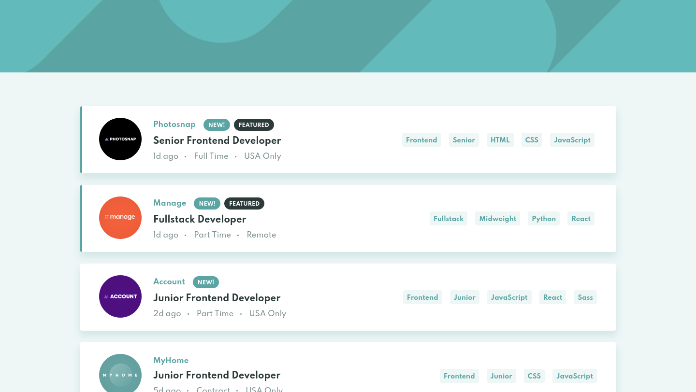

# 📋 Job listings with filtering



## 📄 Descrição

Este projeto é a minha solução para o desafio [Job listings with filtering](https://www.frontendmentor.io/challenges/job-listings-with-filtering-ivstIPCt/hub) do site [Frontend Mentor](https://www.frontendmentor.io/) :D. Os desafios do Frontend Mentor ajudam a melhorar suas habilidades de codificação ao construir projetos realistas.

Trata-se de um app que apresenta uma listagem de vagas de emprego fictícias com funcionalidade de filtragem

## 🔗 Links

- Solução: [aqui](https://www.frontendmentor.io/solutions/reactjs-flexbox-and-bem-iVOH5XKTO)
- Link do projeto: [aqui](https://job-listings-with-filtering-khaki.vercel.app/)

## 🛠 Tecnologias Utilizadas

- [React](https://reactjs.org/)
- [TypeScript](https://www.typescriptlang.org/)
- [Vite](https://vitejs.dev/)

## 🎯 O desafio

- Visualizar o layout ideal do site de acordo com o tamanho da tela do dispositivo
- Ver estados de hover para todos os elementos interativos na página
- Filtrar listagens de empregos com base nas categorias selecionadas

## 📋 Pré-requisitos

Antes de começar, você vai precisar ter instalado em sua máquina as seguintes ferramentas: [Git](https://git-scm.com/), [Node.js](https://nodejs.org/en).

Além disto é bom ter um editor para trabalhar com o código como [VSCode](https://code.visualstudio.com/).

## 🚀 Como Executar

```bash
# Clone este repositório
$ git clone https://github.com/grazziotti/job-listings-with-filtering

# Acesse a pasta do projeto no terminal/cmd
$ cd job-listings-with-filtering

# Instale as dependências
$ npm install

# Execute o projeto
$ npm run dev
```

## 👤 Autor


- Github - [@grazziotti](https://github.com/grazziotti)
- Frontend Mentor - [@grazziotti](https://www.frontendmentor.io/profile/grazziotti)

## Versões do README

- [Inglês 🇺🇸](https://github.com/grazziotti/job-listings-with-filtering/blob/main/README.md)
- [Português 🇧🇷](https://github.com/grazziotti/job-listings-with-filtering/blob/main/README-pt.md)
