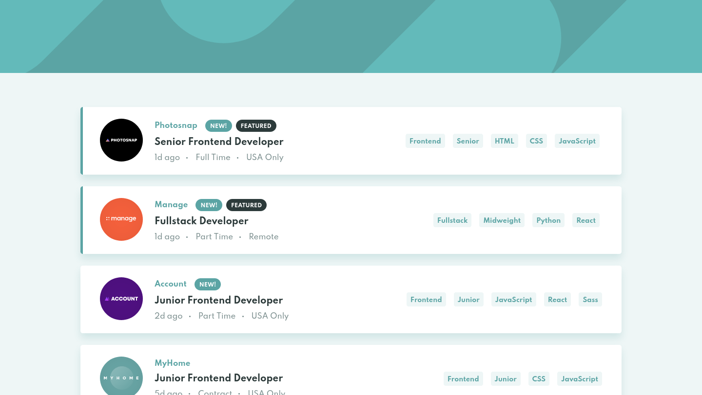

# 📋 Job listings with filtering



## 📄 Description

This project is my solution to the [Job listings with filtering](https://www.frontendmentor.io/challenges/job-listings-with-filtering-ivstIPCt) challenge from the [Frontend Mentor](https://www.frontendmentor.io/) website :D. Frontend Mentor challenges help improve your coding skills by building realistic projects.

It is an app that presents a list of fictional job listings with filtering functionality.

## 🔗 Links

- Solution URL: [here](https://www.frontendmentor.io/solutions/reactjs-flexbox-and-bem-iVOH5XKTO)
- Live site URL: [here](https://job-listings-with-filtering-khaki.vercel.app/)

## 🛠 Built With

- [React](https://reactjs.org/)
- [TypeScript](https://www.typescriptlang.org/)
- [Vite](https://vitejs.dev/)

## 🎯 The Challenge

- View the optimal layout for the site depending on their device's screen size
- See hover states for all interactive elements on the page
- Filter job listings based on the categories selected

## 📋 Prerequisites

Before you start, you will need to have the following tools installed on your machine: [Git](https://git-scm.com/), [Node.js](https://nodejs.org/en).

In addition, it is good to have an editor to work with the code like [VSCode](https://code.visualstudio.com/).

## 🚀 How to Run

```bash
# Clone this repository
$ git clone https://github.com/grazziotti/job-listings-with-filtering

# Navigate to the project folder in the terminal/cmd
$ cd job-listings-with-filtering

# Install the dependencies
$ npm install

# Run the project
$ npm run dev
```

## 👤 Author


- Github - [@grazziotti](https://github.com/grazziotti)
- Frontend Mentor - [@grazziotti](https://www.frontendmentor.io/profile/grazziotti)
